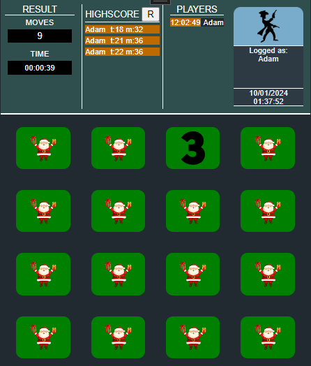
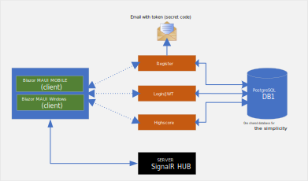
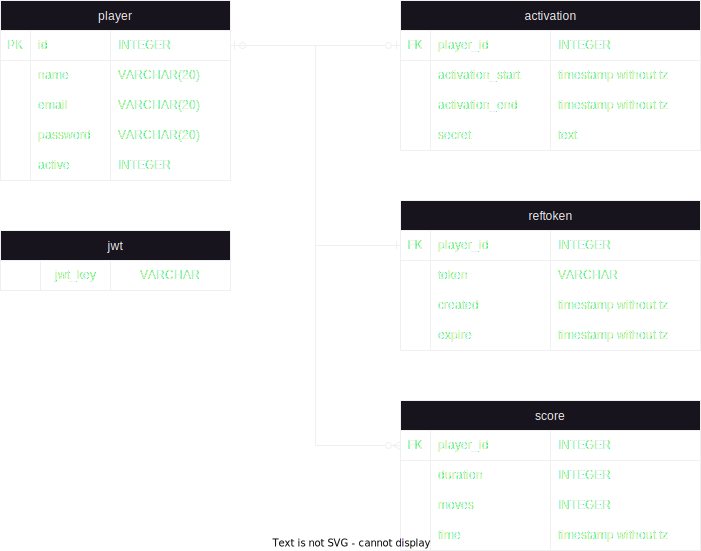

Memory Game
=
## Screenshots  

  

<figure class="image">
    

        
        <figcaption align="center">InGameScreen</figcaption>
    

</figure>  

  

<figure class="image">
    

        
        <figcaption align="center">MemoryGame block schema</figcaption>
    

</figure>

## Services

### Register
**Service responsibilities:**  
* Registering(creating) the user account,
* Sending an email to the user along with the verification code,
* Account activation with verification code
  
**Service routes (endpoints):**  
| Route | Controller |Method | Data Source | Return Statuses |  
| :---  | :---       |:--- | :---   | :--- |
| /api/register | Register | Post | Body | 200/400/409/503 |
| /api/verifytoken | Verification | Post | Body | 200/400 |

**Alghoritms for endpoints:**  
* Register can be found [here](/ReadMeImages/MemoryGame-register_alghoritm.svg),
* Activation can be found [here](/ReadMeImages/MemoryGame-activation_alghoritm.svg).

### Login / Jwt
**Service responsibilities:**  
* Verifying users creditentials (loggin) via basic authentication,
* Creating Jwt token,
* Creating Refresh Token
* Refreshing Jwt Token.

**Service routes (endpoints):**  
| Route | Controller |Method | Data Source | Return Statuses |  
| :---  | :---       |:--- | :---   | :--- |
| /api/login | Login | Post | Header | 200/400/401/500 |
| /api/refresh/jwt | Refresh | Post | Body | 200/400 |

**Alghoritms for endpoints:**  
* Login can be found [here](/ReadMeImages/MemoryGame-login_service.svg),
* Activation can be found [here](/ReadMeImages/MemoryGame-refresh_alghoritm.svg).

### Highscore

**Service responsibilities:**  
* Storing user's games results. 
 
**Service routes (endpoints):**  
| Route | Controller |Method | Data Source | Return Statuses |  
| :---  | :---       |:--- | :---   | :--- |
| /api/result | MinimalApi | Post | Body | 200/400 |
| /api/result | MinimalApi | Get | Route | 200/400 |

**Alghoritms for endpoints:**  
* Adding new result can be found [here](/ReadMeImages/MemoryGame-highscore1-alghoritm.svg.svg),
* Getting result can be found [here](/ReadMeImages/MemoryGame-highscore-get-alghoritm.svg).

### Database

PostgreSql v16.2

**Schema**  
<figure class="image">
    

        
        <figcaption align="center">Database schema</figcaption>
    

</figure>